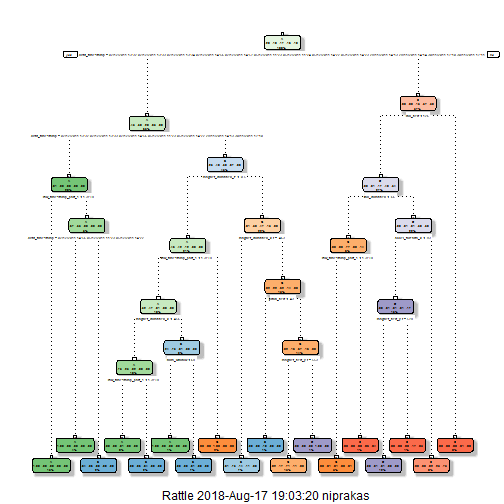
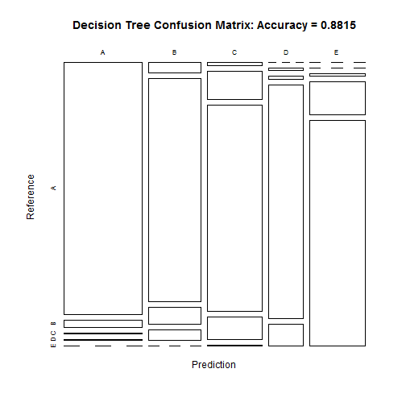
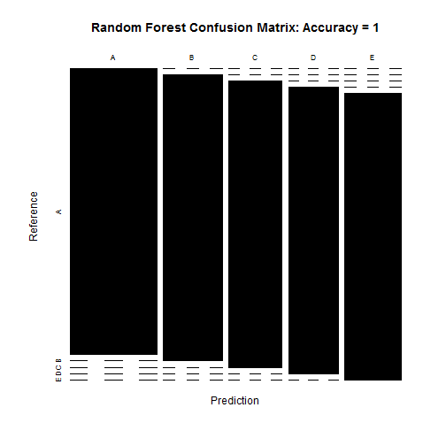
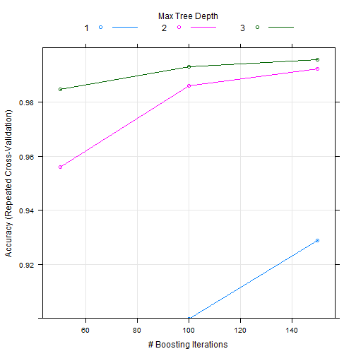

#### Introduction
Using devices such as Jawbone Up, Nike FuelBand, and Fitbit it is now possible to collect a large amount of data about personal activity relatively inexpensively. These type of devices are part of the quantified self movement - a group of enthusiasts who take measurements about themselves regularly to improve their health, to find patterns in their behavior, or because they are tech geeks. One thing that people regularly do is quantify how much of a particular activity they do, but they rarely quantify how well they do it. In this project, your goal will be to use data from accelerometers on the belt, forearm, arm, and dumbell of 6 participants. They were asked to perform barbell lifts correctly and incorrectly in 5 different ways. Our goal is to predict the manner in which they did the exercise.


#### Download and Load the data.

```r
set.seed(12345)
if(!file.exists("pml-training.csv")){
download.file("https://d396qusza40orc.cloudfront.net/predmachlearn/pml-training.csv", destfile = "pml-training.csv")}
trainData<- read.csv("pml-training.csv", sep=",", header=TRUE, na.strings = c("NA","","#DIV/0!"))
if(!file.exists("pml-testing.csv")){
download.file("https://d396qusza40orc.cloudfront.net/predmachlearn/pml-testing.csv", destfile = "pml-testing.csv")}
testData<- read.csv("pml-testing.csv", sep=",", header=TRUE, na.strings = c("NA","","#DIV/0!"))
dim(trainData)
```

```
## [1] 19622   160
```

```r
dim(testData)
```

```
## [1]  20 160
```

#### Cleaning the data.

Remove NearZeroVariance variables

```r
nzv <- nearZeroVar(trainData, saveMetrics=TRUE)
trainData <- trainData[,nzv$nzv==FALSE]
nzv<- nearZeroVar(testData,saveMetrics=TRUE)
testData <- testData[,nzv$nzv==FALSE]
```

Partition the trainData into two trainData_TRAIN & trainData_TEST

```r
partition <- createDataPartition(trainData$classe, p=0.6, list=FALSE)
trainData_TRAIN <- trainData[partition, ]
trainData_TEST <- trainData[-partition, ]
dim(trainData_TRAIN)
```

```
## [1] 11776   124
```

```r
dim(trainData_TEST)
```

```
## [1] 7846  124
```

Remove first column as it contain serial number and Clean variables with more than 60% NA.

```r
trainData_TRAIN <- trainData_TRAIN[c(-1)]
cleanV <- trainData_TRAIN
for(i in 1:length(trainData_TRAIN)) {
    if( sum( is.na( trainData_TRAIN[, i])) /nrow(trainData_TRAIN) >= .7){
        for(j in 1:length(cleanV)){
            if( length( grep(names(trainData_TRAIN[i]), names(cleanV)[j])) == 1){
                cleanV <- cleanV[ , -j]
            }   
        } 
    }
}
trainData_TRAIN <- cleanV
```

Restructure the trainData_TEST and testData.

```r
temp1 <- colnames(trainData_TRAIN)
temp2 <- colnames(trainData_TRAIN[, -58])
trainData_TEST <- trainData_TEST[temp1]
testData <- testData[temp2]
dim(trainData_TEST)
```

```
## [1] 7846   58
```

```r
dim(testData)
```

```
## [1] 20 57
```

Make all the data into same data type

```r
for (i in 1:length(testData) ) {
    for(j in 1:length(trainData_TRAIN)) {
        if( length( grep(names(trainData_TRAIN[i]), names(testData)[j]) ) == 1)  {
            class(testData[j]) <- class(trainData_TRAIN[i])
        }      
    }      
}
testData <- rbind(trainData_TRAIN[2, -58] , testData)
testData <- testData[-1,]
```

Prediction using Decision Trees

```r
set.seed(12345)
DecisionTree <- rpart(classe ~ ., data=trainData_TRAIN, method="class")
fancyRpartPlot(DecisionTree)
```



```r
Pred_DecisionTree <- predict(DecisionTree, trainData_TRAIN, type = "class")
DTree <- confusionMatrix(Pred_DecisionTree, trainData_TRAIN$classe)
DTree
```

```
## Confusion Matrix and Statistics
## 
##           Reference
## Prediction    A    B    C    D    E
##          A 3230   96   12    5    0
##          B   89 1914  140   89    0
##          C   29  256 1867  206    3
##          D    0   13   18 1328  120
##          E    0    0   17  302 2042
## 
## Overall Statistics
##                                           
##                Accuracy : 0.8815          
##                  95% CI : (0.8756, 0.8873)
##     No Information Rate : 0.2843          
##     P-Value [Acc > NIR] : < 2.2e-16       
##                                           
##                   Kappa : 0.8501          
##  Mcnemar's Test P-Value : NA              
## 
## Statistics by Class:
## 
##                      Class: A Class: B Class: C Class: D Class: E
## Sensitivity            0.9648   0.8398   0.9090   0.6881   0.9432
## Specificity            0.9866   0.9665   0.9492   0.9847   0.9668
## Pos Pred Value         0.9662   0.8575   0.7908   0.8979   0.8649
## Neg Pred Value         0.9860   0.9618   0.9801   0.9415   0.9869
## Prevalence             0.2843   0.1935   0.1744   0.1639   0.1838
## Detection Rate         0.2743   0.1625   0.1585   0.1128   0.1734
## Detection Prevalence   0.2839   0.1895   0.2005   0.1256   0.2005
## Balanced Accuracy      0.9757   0.9032   0.9291   0.8364   0.9550
```

```r
plot(DTree$table, col = DTree$byClass, main = paste("Decision Tree Confusion Matrix: Accuracy =", round(DTree$overall['Accuracy'], 4)))
```



Prediction using Random Forests

```r
set.seed(12345)
RandomForest <- randomForest(classe ~ ., data=trainData_TRAIN)
pred_RandomForest <- predict(RandomForest, trainData_TRAIN, type = "class")
RForest <- confusionMatrix(pred_RandomForest, trainData_TRAIN$classe)
RForest
```

```
## Confusion Matrix and Statistics
## 
##           Reference
## Prediction    A    B    C    D    E
##          A 3348    0    0    0    0
##          B    0 2279    0    0    0
##          C    0    0 2054    0    0
##          D    0    0    0 1930    0
##          E    0    0    0    0 2165
## 
## Overall Statistics
##                                      
##                Accuracy : 1          
##                  95% CI : (0.9997, 1)
##     No Information Rate : 0.2843     
##     P-Value [Acc > NIR] : < 2.2e-16  
##                                      
##                   Kappa : 1          
##  Mcnemar's Test P-Value : NA         
## 
## Statistics by Class:
## 
##                      Class: A Class: B Class: C Class: D Class: E
## Sensitivity            1.0000   1.0000   1.0000   1.0000   1.0000
## Specificity            1.0000   1.0000   1.0000   1.0000   1.0000
## Pos Pred Value         1.0000   1.0000   1.0000   1.0000   1.0000
## Neg Pred Value         1.0000   1.0000   1.0000   1.0000   1.0000
## Prevalence             0.2843   0.1935   0.1744   0.1639   0.1838
## Detection Rate         0.2843   0.1935   0.1744   0.1639   0.1838
## Detection Prevalence   0.2843   0.1935   0.1744   0.1639   0.1838
## Balanced Accuracy      1.0000   1.0000   1.0000   1.0000   1.0000
```

```r
plot(RandomForest)
```


```r
plot(RForest$table, col = RForest$byClass, main = paste("Random Forest Confusion Matrix: Accuracy =", round(RForest$overall['Accuracy'], 4)))
```



Prediction using Generalized Boosted Regression

```r
set.seed(12345)
fitControl <- trainControl(method = "repeatedcv", number = 5, repeats = 1)
GenBoost <- train(classe ~ ., data=trainData_TRAIN, method = "gbm", trControl = fitControl, verbose = FALSE)
GenBoost_FM <- GenBoost$finalModel
Pred_GenBoost <- predict(GenBoost, newdata=trainData_TRAIN)
Acc_GenBoost <- confusionMatrix(Pred_GenBoost, trainData_TRAIN$classe)
Acc_GenBoost
```

```
## Confusion Matrix and Statistics
## 
##           Reference
## Prediction    A    B    C    D    E
##          A 3348    0    0    0    0
##          B    0 2279    2    0    0
##          C    0    0 2048    1    0
##          D    0    0    4 1927    1
##          E    0    0    0    2 2164
## 
## Overall Statistics
##                                           
##                Accuracy : 0.9992          
##                  95% CI : (0.9984, 0.9996)
##     No Information Rate : 0.2843          
##     P-Value [Acc > NIR] : < 2.2e-16       
##                                           
##                   Kappa : 0.9989          
##  Mcnemar's Test P-Value : NA              
## 
## Statistics by Class:
## 
##                      Class: A Class: B Class: C Class: D Class: E
## Sensitivity            1.0000   1.0000   0.9971   0.9984   0.9995
## Specificity            1.0000   0.9998   0.9999   0.9995   0.9998
## Pos Pred Value         1.0000   0.9991   0.9995   0.9974   0.9991
## Neg Pred Value         1.0000   1.0000   0.9994   0.9997   0.9999
## Prevalence             0.2843   0.1935   0.1744   0.1639   0.1838
## Detection Rate         0.2843   0.1935   0.1739   0.1636   0.1838
## Detection Prevalence   0.2843   0.1937   0.1740   0.1641   0.1839
## Balanced Accuracy      1.0000   0.9999   0.9985   0.9990   0.9997
```

```r
plot(GenBoost, ylim=c(0.9, 1))
```



#### Conclusion
If we compare the above predection based on Accuracy for the Random forest was more accurate then the Decision Trees or GBM.
The expected out-of-sample error is 0 percent.

#### Using Random Forest Predict result on the test data.

```r
FinalPred <- predict(RandomForest, testData, type = "class")
FinalPred
```

```
##  1  2 31  4  5  6  7  8  9 10 11 12 13 14 15 16 17 18 19 20 
##  B  A  B  A  A  E  D  B  A  A  B  C  B  A  E  E  A  B  B  B 
## Levels: A B C D E
```
